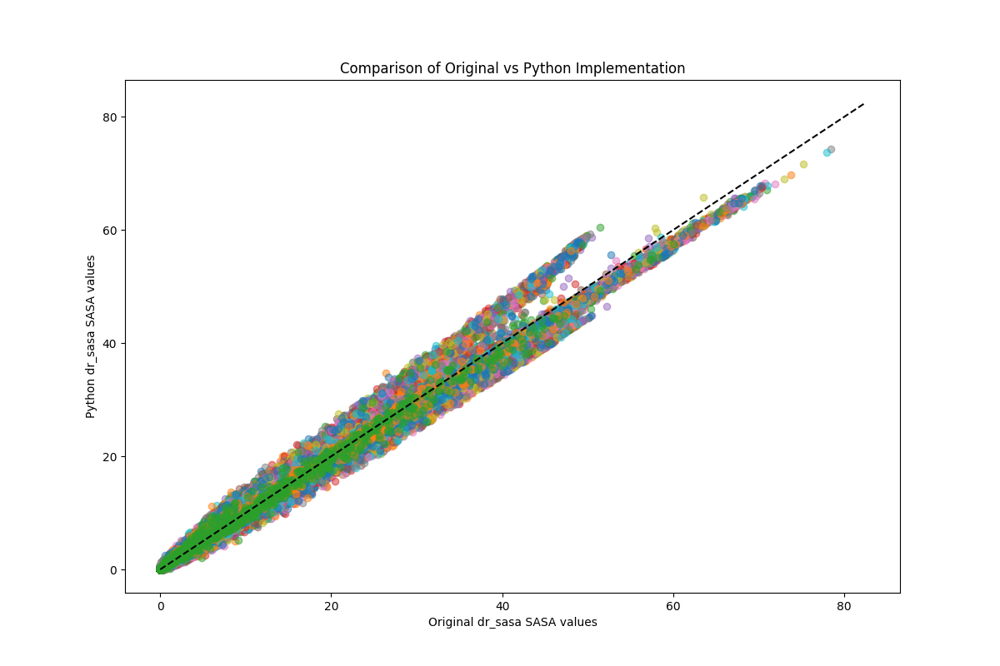

# SASA Calculation Methods Comparison

This benchmark compares different implementations for calculating Solvent Accessible Surface Area (SASA) of proteins using the Prodigydataset:
- dr_sasa Python bindings
- Original dr_sasa C++ implementation
- FreeSASA
- Biopython's SASA implementation

## Hardware Configuration

The benchmark was run on the following system:\
CPU: AMD EPYC 7B12, 16GB working memory with 4 physical cores and 2 threads per core. 

## Benchmark Results

### Processing Summary
- Total structures processed: 79
- Successfully processed: 73
- Failed: 6 (missing of atoms are handled differetly, leading to different sets of atoms.)

### Timing Performance

| Implementation    | Mean (s) ± std    | Median (s) | Min (s) | Max (s) |
|------------------|-------------------|------------|---------|---------|
| dr_sasa Python*   | 0.817 ± 0.480     | 0.717      | 0.183   | 3.468   |
| dr_sasa Original | 1.045 ± 0.603     | 0.940      | 0.261   | 4.438   |
| FreeSASA         | 0.035 ± 0.018     | 0.030      | 0.009   | 0.131   |
| Biopython        | 0.651 ± 0.346     | 0.577      | 0.176   | 2.371   |

Note: The original dr_sasa implementation shows higher execution times primarily due to file I/O overhead, as it requires writing PDB files for output. \
*SimpleSASA Class is used in dr_sasa Python. If GenericSASA the performance is 2.5x slower.

### SASA Comparison Statistics

| Comparison                 | RMSD      | Correlation | Max Difference |
|---------------------------|-----------|-------------|----------------|
| Python vs Original        | 0.002 ± 0.0001 | 1.000 ± 0.000 | 0.007 ± 0.003  |
| Python vs FreeSASA        | 1.321 ± 0.110 | 0.993 ± 0.001 | 10.339 ± 1.068 |
| Python vs Biopython       | 2.246 ± 0.133 | 0.978 ± 0.002 | 12.392 ± 1.068 |
| Original vs FreeSASA      | 1.321 ± 0.110 | 0.993 ± 0.001 | 10.339 ± 1.068 |
| Original vs Biopython     | 2.246 ± 0.133 | 0.978 ± 0.002 | 12.391 ± 1.068 |
| FreeSASA vs Biopython     | 2.031 ± 0.112 | 0.982 ± 0.002 | 12.769 ± 1.448 |

### System Resource Usage
- Average CPU usage: 57.0%
- Peak CPU usage: 1260.2%
- Memory usage: 2.3%

### Key Findings

1. **Speed**: 
   - FreeSASA is the fastest implementation
   - Python bindings perform slightly better than the original implementation (when accounting for I/O overhead)
   - Biopython shows competitive performance

2. **Accuracy**:
   - Perfect correlation (1.000) between Python bindings and original implementation
   - All implementations show strong correlations (>0.97)
   - RMSD values range from 0.002 to 2.25 Ų

3. **Resource Usage**:
   - High CPU utilization across multiple cores
   - Moderate memory footprint
   - Good thread scaling

## Visualization

*Comparison of SASA values between different implementations*

*Distribution of SASA value differences between implementations*

## Technical Details

The benchmark was run with the following settings:
- dr_sasa thread count: 4
- Probe radius: 1.4 Å
- Test dataset: 79 protein structures
- All implementations used default parameters where applicable

## Output Files
The complete analysis results are available in:
- `comparison_summary.csv`: Detailed metrics for each structure
- `full_results.json`: Raw data and comprehensive statistics
- `comparison.log`: Detailed execution log
